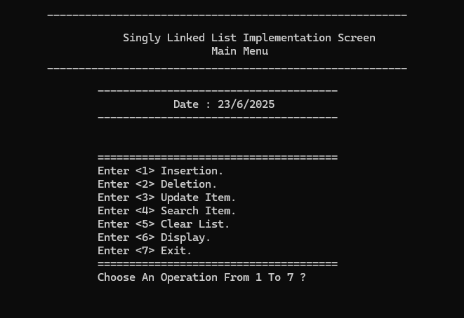
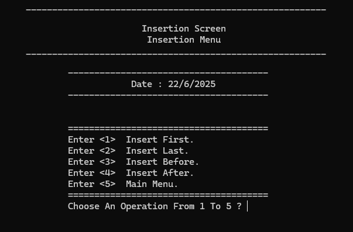
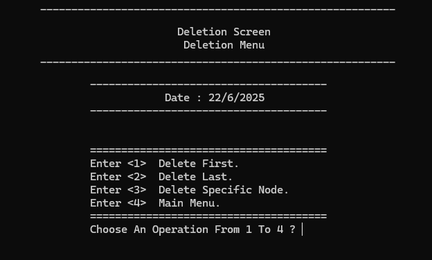

# Singly-LinkedList

**محاكاة شاملة لقائمة مرتبطة منفردة (Singly Linked List)**

---

## 💡 فكرة المشروع  
المشروع عبارة عن تطبيق عملي لهيكل البيانات المعروف بـ "Singly Linked List" باستخدام لغة ++C. يتضمن المشروع تنفيذ شامل لجميع العمليات الأساسية مثل الإضافة، الحذف، البحث، والطباعة، وذلك من خلال واجهة CLI منظمة. الهدف هو تقديم نموذج محاكاة واقعي يعزز الفهم العميق لمفاهيم هياكل البيانات وإدارة الذاكرة اليدوية.

---

## 🛠 الأدوات والتقنيات المستخدمة  
- **لغة البرمجة:** C++  
- **البرمجة الكائنية (OOP)**   
- **إدارة الذاكرة:** باستخدام المؤشرات (Pointers) وعمليات الحجز والتحرير اليدوي  
- **بيئة التطوير:** Visual Studio  
- **نمط التنفيذ:** واجهة نصية CLI  
- **التنظيم:** فصل العمليات إلى ملفات رأسية وملفات تنفيذ لتحقيق قابلية التوسع والتنظيم  
---

## 🧑‍💻 دوري كمطور  
- تحليل وتصميم كامل للعمليات المرتبطة بالقائمة المنفردة  
- فصل منطق التنفيذ إلى ملفات متعددة بأسلوب منظم قابل لإعادة الاستخدام  
- بناء جميع العمليات من الصفر: الإضافة (أول، آخر، قبل، بعد)، الحذف (أول، آخر، وسط)، البحث، الطباعة  
- تنفيذ واجهة CLI للتفاعل مع المستخدم  
- إدارة الذاكرة يدويًا بطريقة آمنة باستخدام المؤشرات  
---

## 🎯 الهدف من المشروع  
ليس فقط تنفيذ قائمة مرتبطة، بل بناء مشروع **منظم واحترافي** يثبت القدرة على تطبيق المفاهيم النظرية في نموذج عملي، مع الاهتمام بالكفاءة، الوضوح، والنظافة في الكود.

---

## صور من النظام

### Main Menu

### Insertion Menu

### Deletion Menu

---

- المطور : محمد أحمد أحمد صلاح الهزمي
- ايميل : alhazmimohammed663@gmail.com
